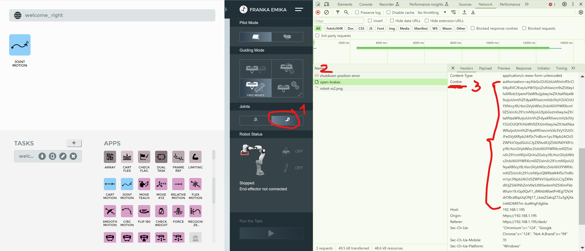

# mad-robot
Repository for exchanging example scripts for the Mapping Festival 2024
by NOW + WOW GmbH, check instagram : [@now_wow_com](https://instagram.com/now_wow_com)

# References
- User manual for the robot Franka Emika Panda: https://download.franka.de/documents/Product%20Manual%20Franka%20Research%203_R02210_1.0_EN.pdf
- OSC library for Python client or server: https://pypi.org/project/python-osc/

# Authentication for the robot
- Got to https://192.168.1.195/desk/ or https://192.168.1.196/desk/ depending on which robot you want to use
- If a Login field pops up, use "fra" for the username and "frafrafra" for the password
- Open the developer tools in your webbrowser (in Chrome it's Ctrl + Shift + I)
- Switch to the tab "network"
- Click on Open or Close Brakes, the command pops up in the network terminal, see screenshot below
- Click on the command and in the Request header, please extract the values for Cookie and for X-Control-Token, you will need them in the code and in Madmapper 

